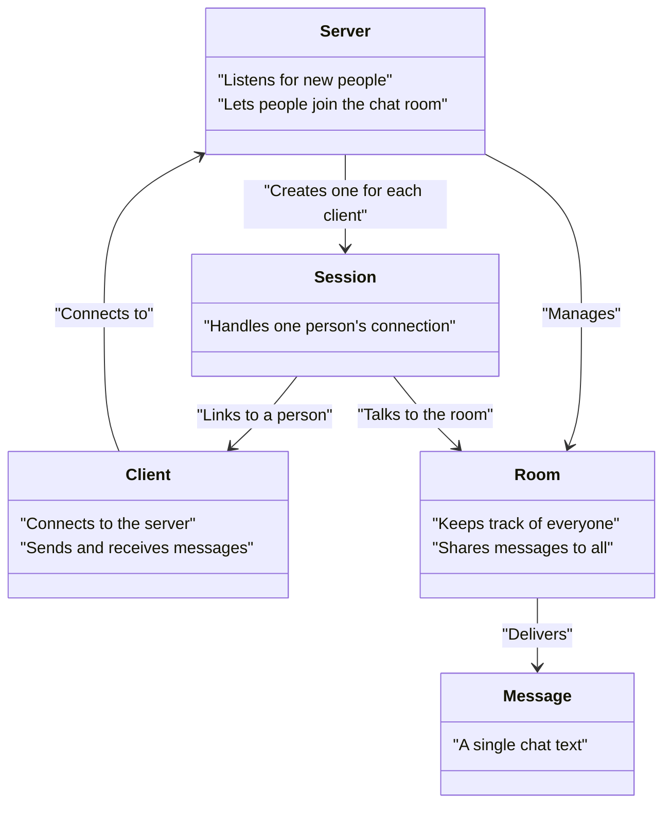

# Peer Chat

## 🛠️ Key Features

- **Asynchronous Networking:** Uses Boost.Asio for non-blocking communication, so many clients can chat at once without slowdowns.
- **Threaded Sessions:** Each client connection runs in its own thread, so everyone gets smooth, instant chats.
- **Simple Room Management:** The server keeps track of who’s in the chat room, and handles adding, removing, and messaging participants.
- **Message Handling:** All message encoding, decoding, and delivery is automatic—just type and chat.

## 🏗️ How Does It Work? (Architecture)

The main parts of the project are:

- **Session:** Manages a single client’s connection. Reads/writes messages, and keeps track of the client’s socket.
- **Room:** Keeps a list of participants in the chat, and delivers messages to everyone currently connected.
- **Message:** The unit of information sent between users; handles encoding/decoding message content.
- **Server:** Waits for new clients and creates a Session for each one, tying them all together through the Room.
- **Client:** Connects to the server, reads user input, and displays chat messages as they arrive.

All networking uses Boost.Asio’s async methods for speed and scalability, and threading lets users chat simultaneously without waiting for each other.

## ⚡ How It All Connects

Here’s the big picture, simply explained:

1. **Server starts and listens for new clients.**
2. **Clients connect** (can be from different terminals or computers!).
3. Whenever someone types a message, their **client sends it to the server**.
4. The **server broadcasts** it to everyone in the chat room—instantly.

## 💡 Conceptual Diagram (Simplified)

> Each client and the server run on their own threads. Messages flow smoothly, with no waiting on slow clients—full concurrency!

You can launch as many clients as you like, each in their own terminal window—even on different machines (as long as they can reach the server’s IP)!

